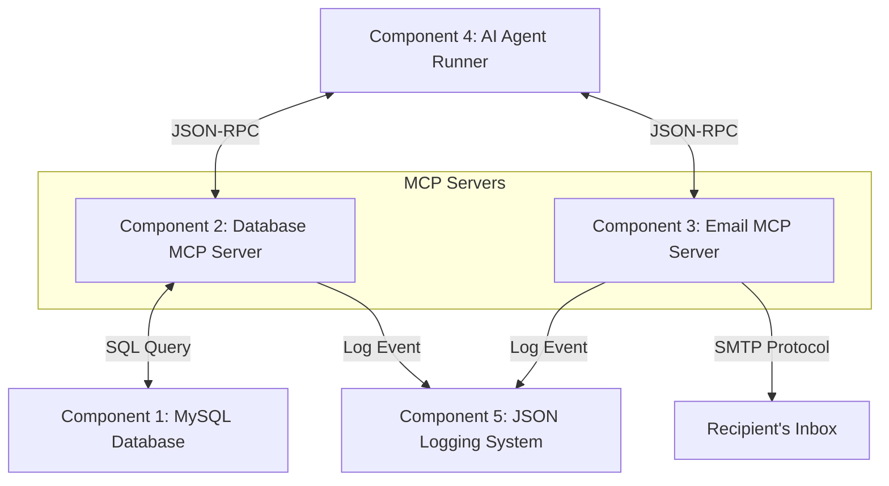

# Agent Security Demo: Database & Email MCPs

This repository contains a full multi-component demo demonstrating the capabilities and potential security risks of AI Agents equipped with database and communication capabilities (Model Context Protocol).

---

## Architecture Overview



---

## Directory Layout
* `db/`: Database configuration and initialization scripts
  * `init_db.sql`: Database schema definition and user creation SQL.
  * `populate_db.py`: Fake data generator to populate tables with 45 realistic employee records.
* `db_mcp/`:
  * `db_server.py`: Exposes database querying tools to any MCP host.
* `email_mcp/`:
  * `email_server.py`: Exposes `send_email` using real SMTP/SSL.
* `utils/`:
  * `mcp_logger.py`: Centralized logging module recording MCP actions to a log file.
* `agent/`:
  * `agent_runner.py`: A self-contained AI Agent script that spawns both MCPs, queries tools, and runs an agent loop.
* `logs/`:
  * `mcp_actions.log`: JSON-line log file storing all tool executions.
* `claude_desktop_config.json`: Configuration template for integration into the official Claude Desktop client.

---

## Component Setup & Operation

### Component 1: Database Setup (Done)
The database has already been successfully initialized and populated.
* **Host**: `localhost`
* **User**: `aparichit`
* **Password**: `letmelogin`
* **Database**: `company_db`
* **Tables created**: `employees` (45 records), `projects` (8 records), `performance_reviews` (30 records).

If you ever need to reset or re-populate the database:
```bash
sudo mysql < db/init_db.sql
python3 db/populate_db.py
```

---

### Component 2 & 3: Database & Email MCP Servers
The MCP servers are written using Python's `FastMCP` framework. They run over standard input/output (stdio), making them compatible with any MCP client (Claude Desktop, cursor, or custom runner).

#### Database MCP Tools:
1. `get_employee(employee_id: int)`: Returns details of an employee and their performance reviews.
2. `search_employees(department: str)`: Lists employees belonging to a specific department.
3. `get_project_details(project_id: int)`: Returns project details (budget, status).
4. `generate_department_report(department: str)`: Generates high-level statistical summary for a department (headcount, salary budgets, rating averages, list of employees).

#### Email MCP Tools:
1. `send_email(recipient: str, subject: str, body: str)`: Sends emails via real SMTP.

**Email Fallback Mode:**
If no SMTP credentials are set in your environment variables, the server operates in a **Mock Email Mode**, writing the email structure to standard output and logging it, allowing risk-free test dry-runs.

---

### Component 4: AI Agent
You can test the agent using the self-contained python runner in `agent/agent_runner.py`.

#### Set API Keys & Configuration
To run the agent, open the `.env` file in the root directory and update the variables:

##### 1. Select your LLM Provider:
* **OpenAI (or Local LLM via Ollama/LM Studio)**:
  * Set `OPENAI_API_KEY` to your API Key.
  * Optionally, configure `OPENAI_BASE_URL` (e.g. `http://localhost:11434/v1`) and `OPENAI_MODEL`.
* **Gemini**:
  * Set `GEMINI_API_KEY` to your API Key.
  * Optionally, configure `GEMINI_MODEL`.

##### 2. Configure Real SMTP:
To enable real email sending (e.g. via Gmail with App Passwords, SendGrid, or Mailtrap), fill in the SMTP variables in `.env`:
* `SMTP_HOST`: e.g. `smtp.gmail.com`
* `SMTP_PORT`: `465` (SSL) or `587` (TLS) or `2525` (Mailtrap)
* `SMTP_USER`: your SMTP username / email address
* `SMTP_PASSWORD`: your SMTP app password / password
* `SENDER_EMAIL`: your email address

#### Run the Agent
Execute the agent runner script and provide a task prompt:
```bash
python3 agent/agent_runner.py "Find the department report for 'Engineering', extract the headcount and average salary, and email this information to ceo@nexustech.com"
```
Or run interactively:
```bash
python3 agent/agent_runner.py
```

---

### Component 5: Logging System
All tool invocations are logged into `logs/mcp_actions.log` in JSON Lines format.

#### Sample DB Log Entry:
```json
{
  "timestamp": "2026-06-23T15:08:10.123456Z",
  "tool": "get_employee",
  "args": {"employee_id": 105},
  "result_size": 248
}
```

#### Sample Email Log Entry:
```json
{
  "timestamp": "2026-06-23T15:08:15.987654Z",
  "tool": "send_email",
  "recipient": "ceo@nexustech.com",
  "subject": "Engineering Department Report Summary"
}
```

To watch the actions live during your demo, run:
```bash
tail -f logs/mcp_actions.log
```

---

### Integration with Claude Desktop
If you prefer running this via the **Claude Desktop** GUI app:
1. Open the Claude Desktop configuration file (typically `~/.config/Claude/claude_desktop_config.json` on Linux/macOS).
2. Copy the contents of `claude_desktop_config.json` inside this repository and merge it.
3. Configure the environment variables (SMTP credentials) inside the `env` section of the config.
4. Restart Claude Desktop. You will see two hammer icons representing the database and email tools.
