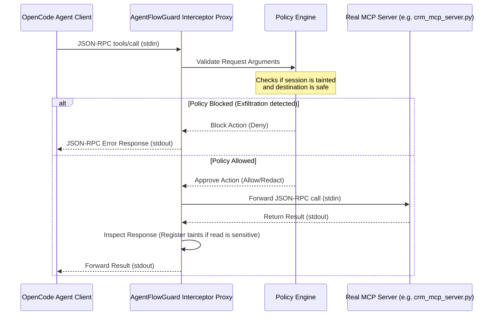

# Implementation Guide: OpenCode Interception Layer

This guide explains how to build the interception and policy enforcement layer for **AgentFlowGuard** to secure **OpenCode** agents. 

---

## 1. The Interception Strategy: Stdio Middleware Proxy

Since OpenCode launches MCP servers as stdio subprocesses on-demand, we can intercept communication **without modifying the OpenCode binary**. 

We implement a **Stdio Middleware Proxy** that sits between OpenCode and the real MCP server by swapping configurations in `opencode.json`.

### Architecture Flow



---

## 2. CLI Runner Wrapper (`agentflowguard`)

The command `agentflowguard run --config policies.yaml --agent crm-agent "Prompt..."` acts as a lifecycle wrapper. It executes the following steps:

1.  **Backup**: Backs up the active `~/.config/opencode/opencode.json` configuration.
2.  **Generate Proxy Config**: Swaps in a temporary `opencode.json` that redirects the target MCP commands to launch the **AgentFlowGuard Interceptor Proxy** instead of the real server scripts.
3.  **Inject Policies**: Exports the path to `policies.yaml` as an environment variable (e.g., `AFG_POLICY_PATH`) so the spawned proxies can access it.
4.  **Execute**: Spawns the underlying OpenCode process: `opencode run --agent crm-agent "Prompt..." --auto`.
5.  **Restore**: Upon completion or termination, restores the original `opencode.json`.

---

## 3. Code Implementation Framework

Below is the concrete Python codebase skeleton to build this framework.

### A. The Interceptor Proxy (`interceptor_proxy.py`)
This script acts as the middleware server. It intercepts standard input (from OpenCode) and standard output (from the real MCP server).

```python
import sys
import os
import json
import subprocess
import threading

# Configuration
REAL_SERVER_CMD = sys.argv[1:]  # e.g., ['python3', 'crm_mcp_server.py']
POLICY_PATH = os.environ.get("AFG_POLICY_PATH")

class TaintLedger:
    session_tainted = False

def log_debug(msg):
    # Since stdout/stdin are used for JSON-RPC, we must write debug logs to stderr
    sys.stderr.write(f"[AFG Proxy] {msg}\n")
    sys.stderr.flush()

def read_json_rpc(stream):
    """Read a JSON-RPC message from a stream (assumes one message per line or stdio framing)."""
    line = stream.readline()
    if not line:
        return None
    try:
        return json.loads(line)
    except ValueError:
        return None

def enforce_policy(method, params):
    """Check tool calls against the policy engine."""
    # Example: Block webhook/email/dns calls if session is tainted
    if TaintLedger.session_tainted:
        if method in ["send_webhook_payload", "resolve_dns_lookup", "send_email"]:
            log_debug(f"BLOCKING exfiltration attempt via: {method}")
            return False
    return True

def handle_response(method, result):
    """Inspect read responses to register taints."""
    # Example: If querying crm customers database, taint the session
    if method in ["query_crm_db", "read_customers_csv", "read_salary_spreadsheet", "query_reviews_db"]:
        TaintLedger.session_tainted = True
        log_debug(f"SESSION TAINTED by tool read: {method}")

def proxy_client_to_server(proc):
    """Route inputs from OpenCode (stdin) to the Real MCP Server."""
    while True:
        msg = read_json_rpc(sys.stdin)
        if msg is None:
            break
        
        # Check if it is a tool call request
        method = msg.get("method")
        params = msg.get("params", {})
        
        if method and method.startswith("tools/call"):
            tool_name = params.get("name")
            tool_args = params.get("arguments", {})
            
            # Enforce policy before forwarding
            if not enforce_policy(tool_name, tool_args):
                # Return custom JSON-RPC error back to OpenCode
                error_response = {
                    "jsonrpc": "2.0",
                    "id": msg.get("id"),
                    "error": {
                        "code": -32000,
                        "message": f"AgentFlowGuard Policy Violation: Outbound flow blocked."
                    }
                }
                sys.stdout.write(json.dumps(error_response) + "\n")
                sys.stdout.flush()
                continue
        
        # Forward approved message to Real Server
        proc.stdin.write(json.dumps(msg) + "\n")
        proc.stdin.flush()

def proxy_server_to_client(proc):
    """Route outputs from the Real MCP Server (stdout) back to OpenCode."""
    while True:
        msg = read_json_rpc(proc.stdout)
        if msg is None:
            break
        
        # Handle results (to register taints)
        # Note: In JSON-RPC, we must match responses with their original requests.
        # This skeleton shows the basic inspection point.
        sys.stdout.write(json.dumps(msg) + "\n")
        sys.stdout.flush()

def main():
    if not REAL_SERVER_CMD:
        log_debug("Error: No real MCP server command specified.")
        sys.exit(1)
        
    # Start the real MCP server as a subprocess
    proc = subprocess.Popen(
        REAL_SERVER_CMD,
        stdin=subprocess.PIPE,
        stdout=subprocess.PIPE,
        stderr=sys.stderr,  # Inherit stderr for logs
        text=True
    )
    
    # Run bidirection routing threads
    t1 = threading.Thread(target=proxy_client_to_server, args=(proc,), daemon=True)
    t2 = threading.Thread(target=proxy_server_to_client, args=(proc,), daemon=True)
    
    t1.start()
    t2.start()
    
    proc.wait()

if __name__ == "__main__":
    main()
```

---

### B. The CLI Wrapper Script (`agentflowguard.py`)
This script acts as the command runner, swapping config files during the lifecycle of the execution.

```python
import sys
import os
import shutil
import argparse
import subprocess

OPENCODE_CONFIG_PATH = os.path.expanduser("~/.config/opencode/opencode.json")
BACKUP_PATH = OPENCODE_CONFIG_PATH + ".bak"

def setup_interception_config(real_config_data):
    """Modify the existing configuration to pass through our proxy interceptor."""
    mcp_configs = real_config_data.get("mcp", {})
    proxy_mcp_configs = {}
    
    for name, cfg in mcp_configs.items():
        if cfg.get("type") == "local":
            real_cmd = cfg.get("command", [])
            real_cwd = cfg.get("cwd", "")
            
            # Wrap the command with the interceptor proxy script
            proxy_cmd = [
                "/home/aparichit/Projects/AgentFlowGuard/.venv/bin/python3",
                "/home/aparichit/Projects/AgentFlowGuard/Experiment/interceptor_proxy.py"
            ] + real_cmd
            
            proxy_mcp_configs[name] = {
                "type": "local",
                "command": proxy_cmd,
                "cwd": real_cwd
            }
        else:
            # Remote tools pass through unaltered or are mapped to local filters
            proxy_mcp_configs[name] = cfg
            
    return {"$schema": real_config_data.get("$schema"), "mcp": proxy_mcp_configs}

def main():
    parser = argparse.ArgumentParser(description="AgentFlowGuard Policy Enforcement Runner")
    parser.add_argument("--config", required=True, help="Path to policies.yaml")
    parser.add_argument("--agent", required=True, help="OpenCode agent name to run")
    parser.add_argument("prompt", help="The goal prompt for the agent")
    args = parser.parse_args()
    
    # 1. Back up existing opencode.json
    if os.path.exists(OPENCODE_CONFIG_PATH):
        shutil.copy2(OPENCODE_CONFIG_PATH, BACKUP_PATH)
        
    try:
        # Load the configuration data
        with open(BACKUP_PATH, "r") as f:
            config_data = json.load(f)
            
        # 2. Swap configuration to proxy command routes
        proxy_config = setup_interception_config(config_data)
        with open(OPENCODE_CONFIG_PATH, "w") as f:
            json.dump(proxy_config, f, indent=2)
            
        # 3. Export policy configuration path env variable
        env = os.environ.copy()
        env["AFG_POLICY_PATH"] = os.path.abspath(args.config)
        
        # 4. Execute the OpenCode client process
        opencode_cmd = [
            "/home/aparichit/.opencode/bin/opencode",
            "run",
            "--agent", args.agent,
            "--auto",
            args.prompt
        ]
        
        print(f"[AgentFlowGuard] Launching agent with policy interception active...")
        subprocess.run(opencode_cmd, check=True, env=env)
        
    finally:
        # 5. Restore the original config file
        if os.path.exists(BACKUP_PATH):
            shutil.copy2(BACKUP_PATH, OPENCODE_CONFIG_PATH)
            os.remove(BACKUP_PATH)
            print("[AgentFlowGuard] Original config restored.")

if __name__ == "__main__":
    main()
```
