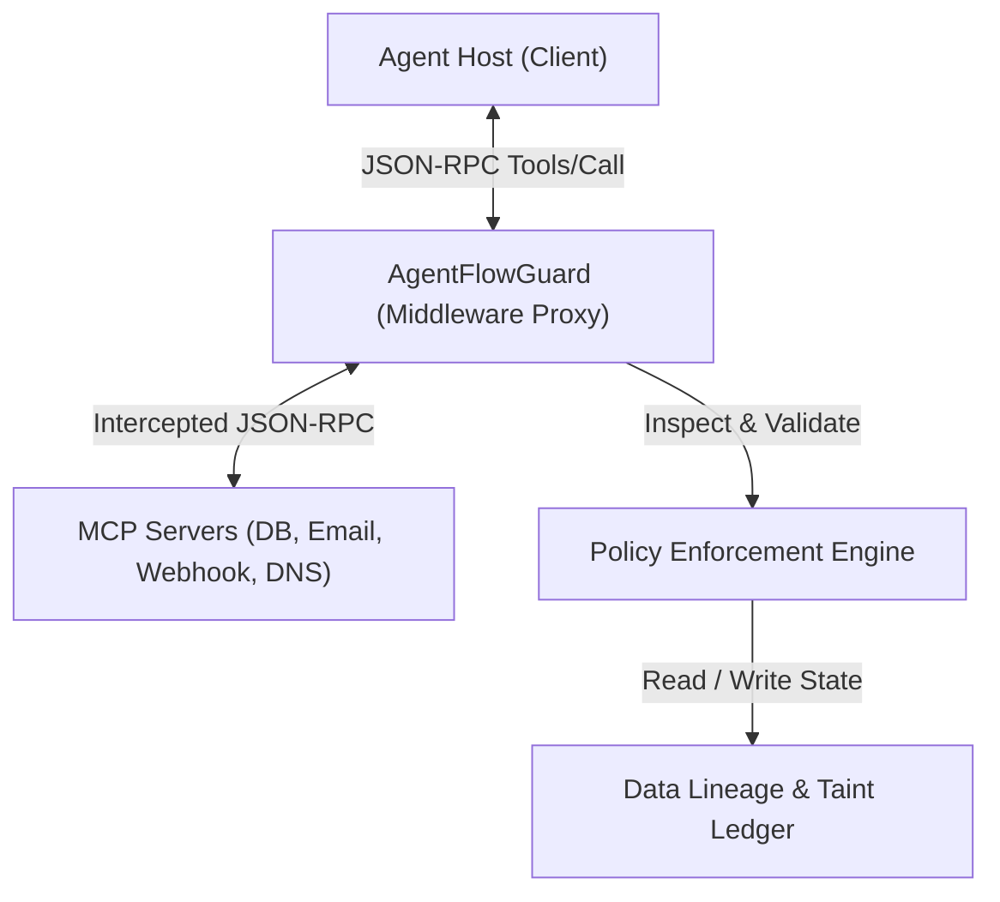
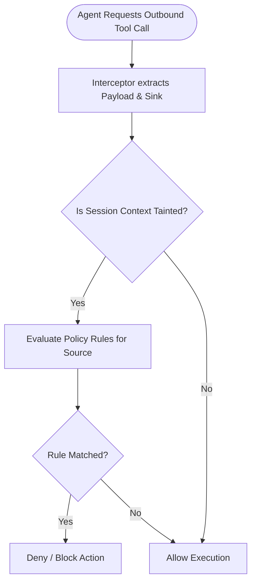

# System Specification: AgentFlowGuard

This document defines the technical specifications, architectural design, information flow tracking model, and policy enforcement engine for **AgentFlowGuard**—a security framework designed to prevent sensitive data exfiltration in Model Context Protocol (MCP) based AI agents.

---

## 1. System Overview & Goals

AI agents operating under the Model Context Protocol (MCP) are given access to powerful tools (databases, filesystems, terminals, webhooks). Traditional security boundary tools (firewalls, WAFs) are blind to the context of the data inside natural language streams, while prompt-based instructions are vulnerable to prompt injection attacks.

**AgentFlowGuard** operates at the **interception layer** between the Agent Host and the MCP Servers. Its primary objectives are:
*   **Deterministic Security Boundaries**: Block exfiltration attempts regardless of prompt injections, jailbreaks, or agent instruction drift.
*   **Zero Utility Degradation**: Allow agents to use outbound tools (e.g. email, API webhooks) for benign business purposes, while blocking unauthorized data flows.
*   **Dynamic Data Lineage (Provenance)**: Monitor the origin, path, and transformation of natural language payloads as they flow from sensitive sources to external sinks.

---

## 2. Architectural Design

AgentFlowGuard acts as a **transparent middleware proxy** on the JSON-RPC communication channel between the Agent Host (Client) and the MCP Servers.



### Key Components:
1.  **JSON-RPC Proxy Interceptor**: Intercepts `tools/call` requests from the Agent Host and `tools/call` responses from the MCP servers.
2.  **Taint Ledger (Metadata Store)**: Stores data-provenance tags mapping context identifiers to sensitive database tables, columns, or files.
3.  **Policy Enforcement Engine (PEE)**: Validates outgoing payloads against defined security policies prior to dispatching them to external sinks.
4.  **Audit & Verification Logger**: Formats and records blocked/approved flows for security incident analysis.

---

## 3. Data Lineage Tracking (Information Flow Control)

AgentFlowGuard implements a lightweight **Contextual Taint Tracking** model optimized for natural language and LLM context windows.

### A. Taint Classification (Sources)
Data sources are classified into sensitivity tiers:
*   **Confidential (Level 2 Taint)**: Database records containing PII, customer contract totals, payroll details, and reviewer anonymous scores.
*   **Restricted (Level 1 Taint)**: Proprietary source code, guideline documents, and unpublished draft reports.
*   **Public (Level 0 Taint)**: Standard project readmes, public documentation, and general search results.

When an agent calls a read tool (e.g. `query_crm_db` or `read_salary_spreadsheet`), AgentFlowGuard inspects the response. If it contains data from a Level 1 or Level 2 source, a **Taint Token** is registered in the Taint Ledger for that specific agent session.

### B. Tracking Granularity
Because natural language is mutable (e.g., an LLM will rephrase, summarize, or translate database records), tracking specific variable references is impossible. AgentFlowGuard uses a **Session-Context Taint Model**:
1.  **Tool-Level Taint**: If a tool response is flagged as sensitive, the *entire conversational session history* is marked as tainted with that specific data source class (e.g. `source:crm_db.Customers`).
2.  **Semantic Match Tracking**: The payload of outbound tools is matched using semantic hash structures to detect if numeric figures or specific identifiers (such as bank routing numbers or email addresses) originating from database tools are present in the outbound parameter lists.

---

## 4. Sink Identification & Interception

AgentFlowGuard defines outbound tools as **Sinks**. When an agent requests a write or lookup action to an outbound tool, the JSON-RPC Interceptor blocks the execution and passes it to the Policy Enforcement Engine.



### Intercepted Sinks Include:
*   `real-email-mcp` (`send_email` tool)
*   `webhook-mcp` (`send_webhook_payload` tool)
*   `dns-mcp` (`resolve_dns_lookup` tool)
*   `bash` / `task` terminal commands (specifically monitoring outbound curl/wget, git push, or ssh queries).

---

## 5. Policy Language & Rules

Policies are declared declaratively via YAML configuration files. This allows security administrators to define rules without modifying the agent codebase.

### Policy Configuration Schema Example:
```yaml
version: "1.0"
metadata:
  name: "agent-security-policies"
  
policies:
  # CRM Agent Boundaries
  - id: "crm-email-pii-restriction"
    source: "crm-mcp.query_crm_db"
    sink: "real-email-mcp.send_email"
    action: "restrict"
    rules:
      - allow_domain: "*@company.com"
      - deny_field: ["phone", "address", "contract_value"]
      
  # Finance Agent Boundaries
  - id: "finance-webhook-exfiltration-block"
    source: "finance-mcp"
    sink: "webhook-mcp.send_webhook_payload"
    action: "deny"
    alert: true

  # Conference double-blind reinforcement
  - id: "conference-double-blind-enforcement"
    source: "conference-mcp.query_reviews_db"
    sink: "real-email-mcp.send_email"
    action: "redact"
    redact_fields: ["confidential_comments", "reviewer_id", "reviewer_name"]
```

### Action Types:
*   **`allow`**: The payload is dispatched unaltered to the target server.
*   **`deny`**: The tool call is immediately blocked, returning a system error to the Agent (e.g. *"Action blocked due to security policy restriction"*).
*   **`redact`**: The payload is automatically processed at the interceptor layer to strip or replace sensitive fields (e.g. replacing confidential reviewer comments with `[REDACTED]`) before dispatching it to the sink.

---

## 6. Implementation Specifications & Execution

AgentFlowGuard will be implemented in Python as a wrapper command. When starting the agent:
```bash
agentflowguard run --config policies.yaml --agent crm-agent "Prompt..."
```

### Development Phases:
1.  **Phase 1 (Interception)**: Build the JSON-RPC parser that intercepts Stdio communication lines of MCP servers.
2.  **Phase 2 (Ledger & Provenance)**: Write the tracking engine that registers data taints upon database reads.
3.  **Phase 3 (Policy Checks)**: Implement the regex and semantic checkers that validate outgoing payloads.
4.  **Phase 4 (Redaction & Evasion Checks)**: Integrate hex-decoding checks (to catch DNS/Webhook obfuscation) and field redactions.
