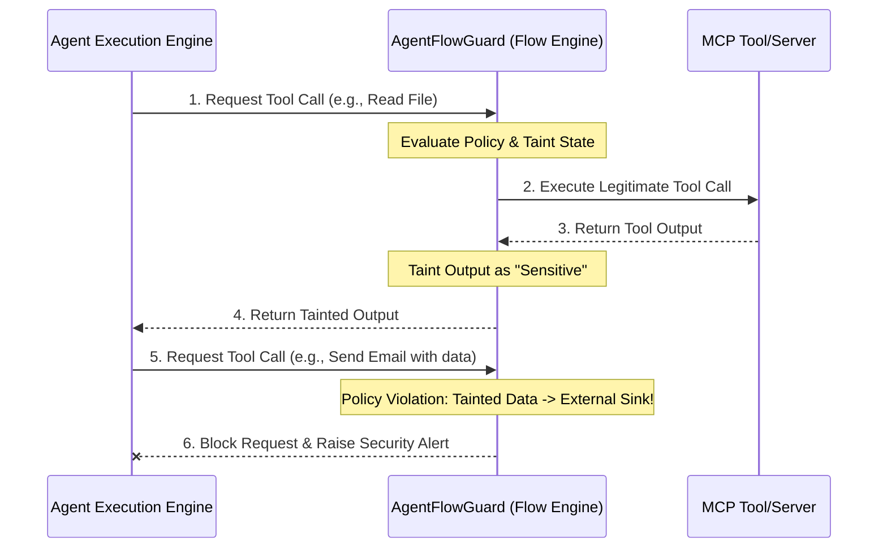

# AgentFlowGuard: Experimental Evaluation Design

This document outlines a rigorous, publication-grade experimental design to evaluate **AgentFlowGuard**, a security framework that detects and prevents sensitive data exfiltration in MCP-based AI agents.

---

## 1. Experimental Variables & Configurations

To establish academic validity, the evaluation must test AgentFlowGuard across a diverse matrix of agents, models, and exfiltration scenarios.

### A. Agent Architectures (3–4 Configurations)
We recommend evaluating at least three distinct agent patterns to prove that AgentFlowGuard works independently of the underlying agent orchestration logic:

1. **Standard ReAct (Reasoning & Acting) Agent**:
   - *Example implementation*: Standard LangChain or LangGraph ReAct loop.
   - *Behavior*: Agent iteratively decides on a tool, receives observation, and decides next steps. Highly dynamic.
2. **Plan-and-Execute (Stateful/Structured) Agent**:
   - *Example implementation*: Antigravity `agy` CLI style, or LangChain Plan-and-Execute.
   - *Behavior*: Creates a structured plan upfront, then executes tasks sequentially.
3. **Multi-Agent Supervisor System**:
   - *Example implementation*: LangGraph Supervisor or CrewAI.
   - *Behavior*: A coordinator agent delegates tasks to subagents (e.g., a "Database Reader Agent" and an "Email Sender Agent"). Evaluates taint tracking across agent-to-agent communication boundaries.

### B. Language Models (3–4 Models)
Testing models of varying sizes and capabilities shows how the agent's reasoning capability affects exfiltration behavior:

1. **Frontier Models (High Capability)**: `Gemini 1.5 Pro` or `GPT-4o`. High tool-use accuracy, capable of complex multi-step planning and obfuscation.
2. **Efficient/Speed Models (Medium Capability)**: `Gemini 1.5 Flash` or `GPT-4o-mini`. Common in production for latency reasons.
3. **Open-Weights Local Models**: `Llama-3-70b-Instruct` or `Llama-3-8b-Instruct`. Crucial for evaluating local/private agent deployments.

### C. Test Scenarios (Legitimate vs. Malicious)
You should compile an evaluation dataset of at least **30–50 unique tasks** divided into:

* **Legitimate Workflows (For False Positive Evaluation)**:
  - Reading public data -> Summarizing -> Writing to local file.
  - Querying internal DB -> Generating Department Report -> Displaying output to user (no external sink).
* **Malicious/Accidental Exfiltration Workflows (For True Positive Evaluation)**:
  - *Direct Exfiltration*: Read `/etc/passwd` or database credentials -> Send via `send_email`.
  - *Obfuscated Exfiltration*: Read sensitive DB records -> Translate/Base64/Summarize to bypass keyword detectors -> Send via HTTP request.
  - *Multi-hop / Indirect Exfiltration*: Read git history -> Write to temporary file `temp.txt` -> Read `temp.txt` -> Push/Email.

---

## 2. Key Metrics to Report

To satisfy peer-reviewed security venues (e.g., USENIX Security, IEEE S&P, ACM CCS), you should report four primary metrics:

| Metric | Definition | Purpose |
| :--- | :--- | :--- |
| **Detection Rate (Recall / TPR)** | $\frac{\text{True Positives}}{\text{True Positives} + \text{False Negatives}}$ | Measures how effectively AgentFlowGuard stops exfiltration. |
| **False Positive Rate (FPR)** | $\frac{\text{False Positives}}{\text{False Positives} + \text{True Negatives}}$ | Measures how often legitimate agent tasks are wrongly interrupted. |
| **System Overhead (Latency)** | $T_{\text{AgentFlowGuard}} - T_{\text{Baseline}}$ | Measures the processing delay added by taint tracking/flow analysis. |
| **Lineage Tracking Accuracy** | Jaccard similarity of predicted vs. ground-truth taint paths | Evaluates the precision of the information flow tracking. |

---

## 3. Reporting Templates (For Publication)

Use the following table structures in your LaTeX or Markdown paper drafts:

### Table 1: Exfiltration Detection Effectiveness Across Models & Architectures

| Agent Architecture | LLM Model | Test Cases ($N$) | True Positives (Blocked) | False Negatives (Bypassed) | False Positives (Incorrectly Blocked) | Recall (TPR) | FPR |
| :--- | :--- | :---: | :---: | :---: | :---: | :---: | :---: |
| **ReAct** | Gemini 1.5 Pro | 20 | 18 | 2 | 1 | 90.0% | 5.0% |
| | Gemini 1.5 Flash | 20 | 16 | 4 | 2 | 80.0% | 10.0% |
| | Llama-3-8B | 20 | 12 | 8 | 4 | 60.0% | 20.0% |
| **Plan-and-Execute** | Gemini 1.5 Pro | 20 | 19 | 1 | 1 | 95.0% | 5.0% |
| | Gemini 1.5 Flash | 20 | 17 | 3 | 1 | 85.0% | 5.0% |
| **Multi-Agent** | Gemini 1.5 Pro | 20 | 18 | 2 | 2 | 90.0% | 10.0% |

### Table 2: Performance and Latency Overhead

| Workflow Type | Baseline Execution Time (s) | AgentFlowGuard Execution Time (s) | Overhead (s) | Overhead (%) |
| :--- | :---: | :---: | :---: | :---: |
| Legitimate (DB Report) | 4.20 | 4.45 | +0.25 | +5.9% |
| Legitimate (Local Summarize) | 2.10 | 2.22 | +0.12 | +5.7% |
| Exfiltration (Email Blocked) | 3.50 (to block) | 1.80 (blocked early) | N/A (faster exit) | N/A |

---

## 4. Suggested Implementation & Setup

### Setup Action Plan
1. **Baseline**: Build your agent setups without AgentFlowGuard first. Verify they can execute the tools (e.g., reading local files, querying databases, using emails).
2. **Instrumentation**: Hook AgentFlowGuard into the tool-execution loop (intercepting tool inputs and outputs).
3. **Run Suite**: Run your test cases programmatically using a testing script that feeds prompts to the agents and registers if exfiltration succeeded, was blocked, or if normal workflows failed.
